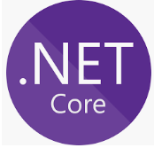
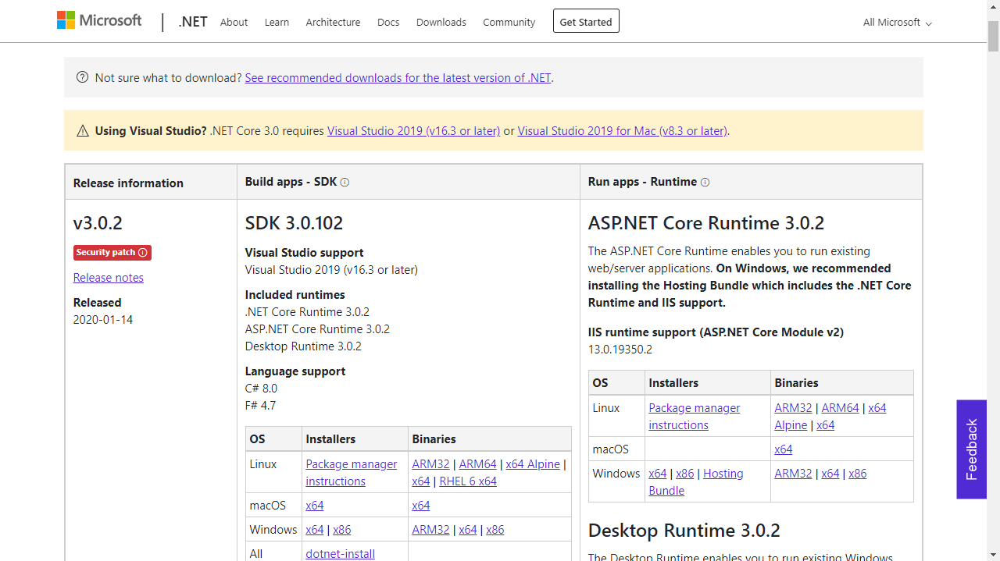
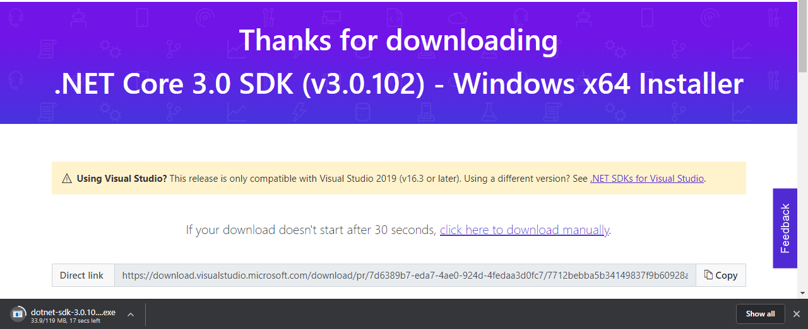
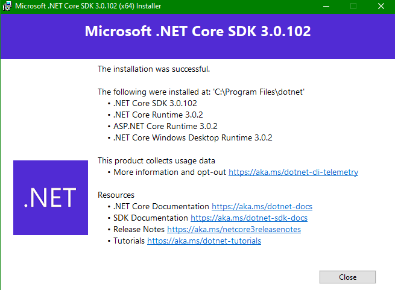
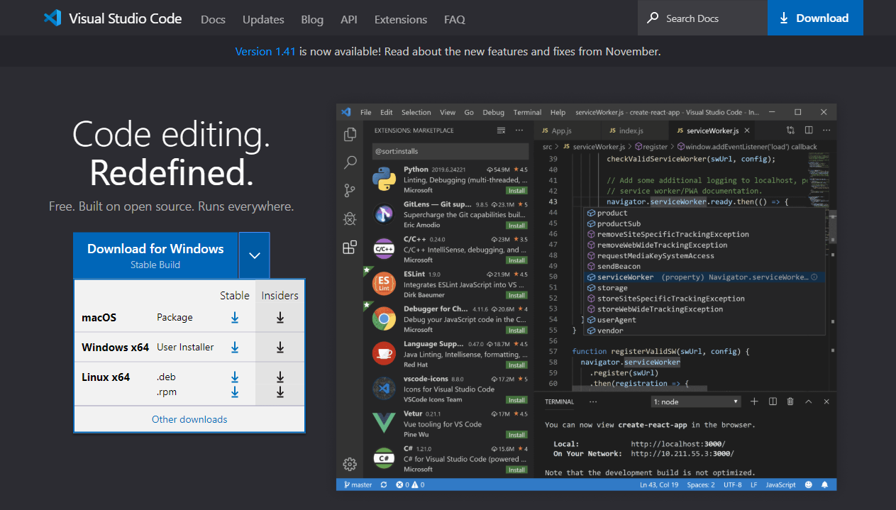
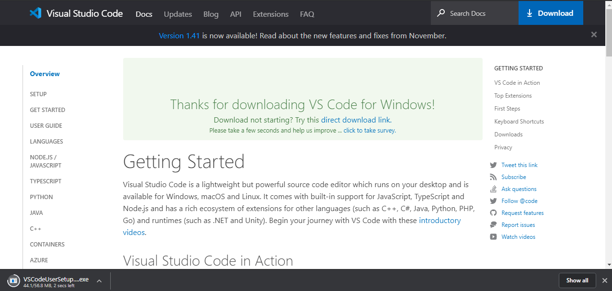

# ACTIVIDAD 1: Ejercicio de MarkDown en Github

## Instalación de dotnet core 2.2.

### .NET Core es un software de codigo abierto desarrollado por la Fundacion NET, pero actualmente adquirido por Microsoft.

### Los pasos para instalar .NET Core son los siguientes:

#### Primero entramos al siguiente [Link](https://dotnet.microsoft.com/download/dotnet-core/3.0 "Link de descarga de .NET Core"), aparecerá una pagina que se ve de la siguiente manera:

#### En esta pagina selecciona la version de acuerdo a tu sistema operativo, ya sea Linux, macOS o Windows, posteriormente te enviará a otra página del sitio confirmando que se esta llevando a cabo la descarga: 

#### Despues, abre el instalador al finalizar la descarga y se abrira una ventana, donde daremos click en "Install" de esta manera:

### Nota: Te solicitará permisos de Administrador, por lo que para llevar a cabo la instalacion debes dar click en "Si".

#### Al final de la instalacion aparecera la siguiente ventana y al dar click en "Close" se cerrara, y listo:

## Instalación y configuración de Visual Studio Code para C#.

#### Para instalar Visual Studio Code debes entrar al siguiente [Link](https://code.visualstudio.com "Link de descarga de Visual Studio Code"), aparecerá una pagina que se ve de la siguiente manera:

#### Selecciona la versión de acuerdo a tu sistema operativo y  se confirmará tu descarga enviandote a la siguiente página:

## Instalación de git. conectado a tu cuenta de GitHub y VSC.