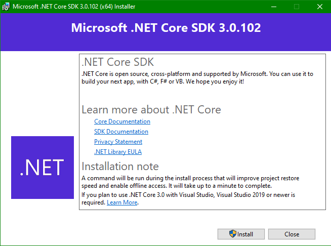

# ACTIVIDAD 1: Ejercicio de MarkDown en Github

## Instalación de dotnet core 2.2.

### .NET Core es un software de codigo abierto desarrollado por la Fundacion NET, pero actualmente adquirido por Microsoft.

### Los pasos para instalar .NET Core son los siguientes:

#### Primero entramos al siguiente [Link](https://dotnet.microsoft.com/download/dotnet-core/3.0 "Link de descarga de .NET Core"), aparecerá una pagina que se ve de la siguiente manera:

#### En esta pagina selecciona la version de acuerdo a tu sistema operativo, ya sea Linux, macOS o Windows, posteriormente te enviará a otra página del sitio confirmando que se esta llevando a cabo la descarga: 

#### Despues, abre el instalador al finalizar la descarga y se abrira una ventana, donde daremos click en "Install" de esta manera:

### Nota: Te solicitará permisos de Administrador, por lo que para llevar a cabo la instalacion debes dar click en "Si".

#### Al final de la instalacion aparecera la siguiente ventana y al dar click en "Close" se cerrara, y listo:

## Instalación y configuración de Visual Studio Code para C#.

#### Para instalar Visual Studio Code debes entrar al siguiente [Link](https://code.visualstudio.com "Link de descarga de Visual Studio Code"), aparecerá una pagina que se ve de la siguiente manera:

#### Selecciona la versión de acuerdo a tu sistema operativo y  se confirmará tu descarga enviandote a la siguiente página:

#### Abrimos en instalador, le concedemos los permisos de Administrador, aceptamos el acuerdo de licencia y damos click en siguiente como se muestra en la imagen:

#### Seleccionamos la ruta donde queremos instalar Visual Studio Code y damos click en "Siguiente":

#### Aqui simplemente damos nuevamente "Siguiente":

#### Marcamos las casillas que marca en la siguiente imagen y posteriormente "Siguiente":

#### Damos click en "Instalar"

#### Esperamos a que termine la instalacion y damos click en Finalizar, tambien desmarcar la casilla para ejecutar Visual Studio Code al cerrar el instalador si asi lo desea.

### Listo.

## Instalación de git. conectado a tu cuenta de GitHub y VSC.

#### Para Instalar Git entramos al siguiente [Link](https://git-scm.com/ "Link de descarga de Git"), aparecera de la siguiente manera: 

#### Seleccionamos la version de acuerdo a nuestro sistema operativo:

#### Nos mandara a la siguiente pagina para confirmar que nuestra descarga se esta realizando:

#### Abrimos el instalador, le concedemos los permisos de administrador y se nos abrira la siguiente ventana:

#### Daremos click en "Next", posteriormente seleccionamos la ruta de donde se instalara Git y volvemos a dar "Next"

#### Apareceran muchas casillas para marcar o desmarcar, pero pasaremos de ellas y daremos "Next" 

#### Nuevamente "Next" y "Next" hasta llegar a la siguiente parte para dar click en "Install":

#### Y con eso ya quedaria instalado Git, pero aun queda conectarlo a nuestra cuenta de Github y Visual Studio Code, abrimos Git y tecleamos lo siguiente: git config -- global user.name "[Nombre de Usuario]"
#### El nombre de usuario debe de estar entre comillas.
#### Posteriormente teclearemos el correo de la siguiente forma: git config -- global user.email [Correo electronico]
#### Nota: el --global solo lo tendremos que hacer una unica vez, posteriormente no sera necesario escribirlo.

#### Por ultimo para corroborrar que lo hicimos correctamente tecleamos: git config --list

#### Quedaria de la siguiente manera:

